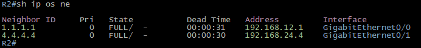
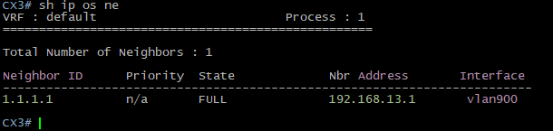
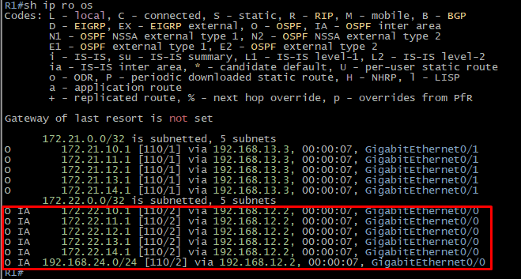
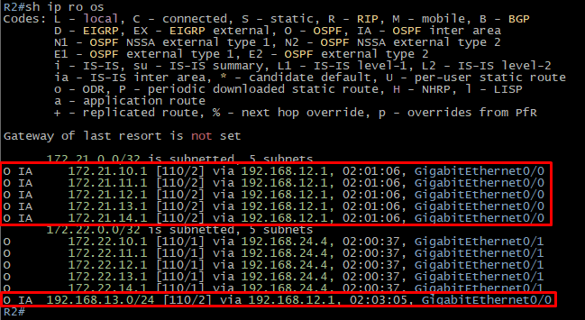
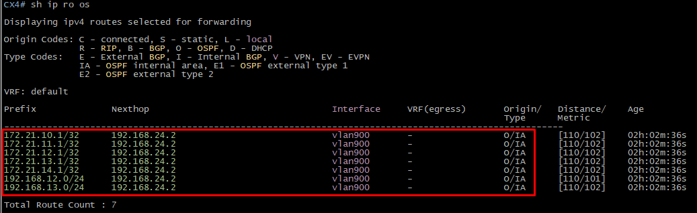

## Topología

## Configuración OSPF (Cisco)
**R1**
```go
!
interface GigabitEthernet0/0
 description CNX-R2
 ip address 192.168.12.1 255.255.255.0
 ip ospf network point-to-point
 ip ospf 1 area 0
!
interface GigabitEthernet0/1
 description CNX-CX3
 ip address 192.168.13.1 255.255.255.0
 ip ospf network point-to-point
 ip ospf 1 area 11
!
router ospf 1
 router-id 1.1.1.1
!
```
**R2**
```go
!
interface GigabitEthernet0/0
 description CNX-R1
 ip address 192.168.12.2 255.255.255.0
 ip ospf network point-to-point
 ip ospf 1 area 0
!
interface GigabitEthernet0/1
 description CNX-CX4
 ip address 192.168.24.2 255.255.255.0
 ip ospf network point-to-point
 ip ospf 1 area 22
!
router ospf 1
 router-id 2.2.2.2
!
```
## Configuración OSPF - Authentication (Cisco)
**R1**
```go
!
interface GigabitEthernet0/0
 ip ospf message-digest-key 1 md5 Ospf123!
!
interface GigabitEthernet0/1
 ip ospf message-digest-key 1 md5 Ospf123!
!
router ospf 1
 area 0 authentication message-digest
 area 11 authentication message-digest
!
```
**R2**
```go
!
interface GigabitEthernet0/0
 ip ospf message-digest-key 1 md5 Ospf123!
!
interface GigabitEthernet0/1
 ip ospf message-digest-key 1 md5 Ospf123!
!
router ospf 1
 area 0 authentication message-digest
 area 22 authentication message-digest
!
```

## Configuración OSPF (ArubaOS CX)
**CX3**
```go
!
vlan 900
interface 1/1/7
    description CNX-R1
    no shutdown
    no routing
    vlan access 900
interface vlan 900
    ip address 192.168.13.3/24
    ip ospf 1 area 0.0.0.11
    no ip ospf passive
    ip ospf network point-to-point
!
router ospf 1
    router-id 3.3.3.3
    passive-interface default
    area 0.0.0.11            
```
**CX4**
```go
!
vlan 900
interface 1/1/7
    description CNX-R2
    no shutdown
    no routing
    vlan access 900
interface vlan 900
    ip address 192.168.24.4/24
    ip ospf 1 area 0.0.0.22
    no ip ospf passive
    ip ospf network point-to-point
!
router ospf 1
    router-id 4.4.4.4
    passive-interface default
    area 0.0.0.22 
```
## Configuración OSPF - Authentication (ArubaOS CX)
**CX3**
```go
!
interface vlan 900
    ip ospf authentication message-digest
    ip ospf message-digest-key 1 md5 plaintext Ospf123!         
```
**CX4**
```go
!
interface vlan 900
    ip ospf authentication message-digest
    ip ospf message-digest-key 1 md5 plaintext Ospf123!
```
## OSPF - Neighbords
**R1**


**R2**



**CX3**



**CX4**


## Configuración Loopbacks
**CX3**
```go
!
interface loopback 10
    ip address 172.21.10.1/24
    ip ospf 1 area 0.0.0.11
interface loopback 11
    ip address 172.21.11.1/24
    ip ospf 1 area 0.0.0.11
interface loopback 12
    ip address 172.21.12.1/24
    ip ospf 1 area 0.0.0.11
interface loopback 13
    ip address 172.21.13.1/24
    ip ospf 1 area 0.0.0.11
interface loopback 14
    ip address 172.21.14.1/24
    ip ospf 1 area 0.0.0.11
!
```
**CX4**
```go
!
interface loopback 10
    ip address 172.22.10.1/24
    ip ospf 1 area 0.0.0.22
interface loopback 11
    ip address 172.22.11.1/24
    ip ospf 1 area 0.0.0.22
interface loopback 12
    ip address 172.22.12.1/24
    ip ospf 1 area 0.0.0.22
interface loopback 13
    ip address 172.22.13.1/24
    ip ospf 1 area 0.0.0.22
interface loopback 14
    ip address 172.22.14.1/24
    ip ospf 1 area 0.0.0.22
!
```
## OSPF - Routing Table
**R1**



**R2**



**CX3**


**CX4**



## OSPF - Route Filtering
Se requiere filtrar las siguientes IPs en CX3:
* 172.22.11.1/32
* 172.22.13.1/32
**CX3**
```go
!                                           
ip prefix-list PL1 seq 5 deny 172.22.11.1/32
ip prefix-list PL1 seq 10 deny 172.22.13.1/32
ip prefix-list PL1 seq 1000 permit any
!
router ospf 1
    distribute-list prefix PL1 in
```


> Una vez aplicado el filtro se observa que las IPs siguen en la Database Table, esto debido a que el Database Table debe ser igual en toda el área OSPF, pero ya no se inyectan en la tabla de enrutamiento.