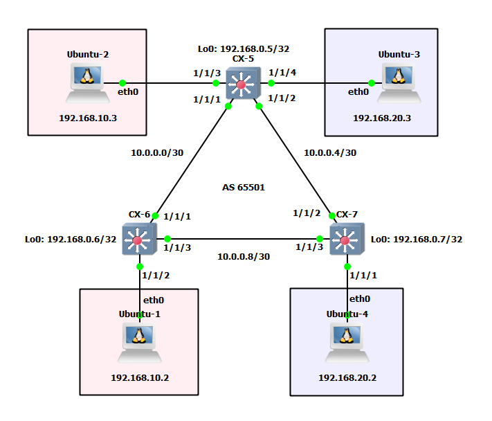

## Topoligía

## Configuración OSPF
**CX-5**
```go
router ospf 1
    router-id 192.168.0.5
    area 0.0.0.0

interface 1/1/1
    no shutdown
    ip address 10.0.0.1/30
    ip ospf 1 area 0.0.0.0
    ip ospf network point-to-point
interface 1/1/2
    no shutdown
    ip address 10.0.0.5/30
    ip ospf 1 area 0.0.0.0
    ip ospf network point-to-point
interface loopback 0
    ip address 192.168.0.5/32
    ip ospf 1 area 0.0.0.0
```
**CX-6**
```go
router ospf 1
    router-id 192.168.0.6
    area 0.0.0.0

interface 1/1/1
    no shutdown
    ip address 10.0.0.2/30
    ip ospf 1 area 0.0.0.0
    ip ospf network point-to-point
interface 1/1/3
    no shutdown
    ip address 10.0.0.9/30
    ip ospf 1 area 0.0.0.0
    ip ospf network point-to-point
interface loopback 0
    ip address 192.168.0.6/32
    ip ospf 1 area 0.0.0.0
```
**CX-7**
```go
router ospf 1
    router-id 192.168.0.7
    area 0.0.0.0

interface 1/1/2
    no shutdown
    ip address 10.0.0.6/30
    ip ospf 1 area 0.0.0.0
    ip ospf network point-to-point
interface 1/1/3
    no shutdown
    ip address 10.0.0.10/30
    ip ospf 1 area 0.0.0.0
    ip ospf network point-to-point
interface loopback 0
    ip address 192.168.0.7/32
    ip ospf 1 area 0.0.0.0
```
## Configuración VXLAN
**CX-5**
```go
vlan 1,10,20
interface vxlan 1
    source ip 192.168.0.5
    no shutdown
    vni 1010
        vlan 10
    vni 1020
        vlan 20
```
**CX-6**
```go
vlan 1,10,20
interface vxlan 1                                              
    source ip 192.168.0.6
    no shutdown
    vni 1010
        vlan 10
    vni 1020
        vlan 20
```
**CX-7**
```go
vlan 1,10,20
interface vxlan 1                                              
    source ip 192.168.0.7
    no shutdown
    vni 1010
        vlan 10
    vni 1020
        vlan 20
```
## Configuración EVPN
**CX-5**
```go
router ospf 1
    router-id 192.168.0.5
    area 0.0.0.0
router bgp 65501
    bgp router-id 192.168.0.5
    neighbor 192.168.0.6 remote-as 65501
    neighbor 192.168.0.6 update-source loopback 0
    neighbor 192.168.0.7 remote-as 65501                       
    neighbor 192.168.0.7 update-source loopback 0
    address-family l2vpn evpn
        neighbor 192.168.0.6 activate
        neighbor 192.168.0.6 send-community extended
        neighbor 192.168.0.7 activate
        neighbor 192.168.0.7 send-community extended
    exit-address-family

evpn
    vlan 10
        rd auto
        route-target export auto
        route-target import auto
    vlan 20
        rd auto                                                
        route-target export auto
        route-target import auto
```
**CX-6**
```go
router bgp 65501
    bgp router-id 192.168.0.6
    neighbor 192.168.0.5 remote-as 65501
    neighbor 192.168.0.5 update-source loopback 0
    neighbor 192.168.0.7 remote-as 65501
    neighbor 192.168.0.7 update-source loopback 0
    address-family l2vpn evpn
        neighbor 192.168.0.5 activate
        neighbor 192.168.0.5 send-community extended           
        neighbor 192.168.0.7 activate
        neighbor 192.168.0.7 send-community extended
    exit-address-family

evpn
    vlan 10
        rd auto
        route-target export auto
        route-target import auto
    vlan 20
        rd auto                                                
        route-target export auto
        route-target import auto
```
**CX-7**
```go
router bgp 65501
    bgp router-id 192.168.0.7
    neighbor 192.168.0.5 remote-as 65501
    neighbor 192.168.0.5 update-source loopback 0
    neighbor 192.168.0.6 remote-as 65501
    neighbor 192.168.0.6 update-source loopback 0
    address-family l2vpn evpn
        neighbor 192.168.0.5 activate
        neighbor 192.168.0.5 send-community extended           
        neighbor 192.168.0.6 activate
        neighbor 192.168.0.6 send-community extended
    exit-address-family

evpn
    vlan 10
        rd auto
        route-target export auto
        route-target import auto
    vlan 20
        rd auto                                                
        route-target export auto
        route-target import auto
```
## Pruebas de conectividad
**Ubuntu-1 -> Ubuntu-2**
```go
root@Ubuntu-1:~# ping 192.168.10.3
PING 192.168.10.3 (192.168.10.3) 56(84) bytes of data.
64 bytes from 192.168.10.3: icmp_seq=1 ttl=64 time=5.35 ms
64 bytes from 192.168.10.3: icmp_seq=2 ttl=64 time=2.50 ms
64 bytes from 192.168.10.3: icmp_seq=3 ttl=64 time=4.46 ms
64 bytes from 192.168.10.3: icmp_seq=4 ttl=64 time=2.29 ms
64 bytes from 192.168.10.3: icmp_seq=5 ttl=64 time=2.62 ms
^C
--- 192.168.10.3 ping statistics ---
5 packets transmitted, 5 received, 0% packet loss, time 4005ms
rtt min/avg/max/mdev = 2.290/3.441/5.348/1.229 ms
```
**Ubuntu-3 -> Ubuntu-4**
```go
root@Ubuntu-3:~# ping 192.168.20.2
PING 192.168.20.2 (192.168.20.2) 56(84) bytes of data.
64 bytes from 192.168.20.2: icmp_seq=1 ttl=64 time=7.81 ms
64 bytes from 192.168.20.2: icmp_seq=2 ttl=64 time=3.12 ms
64 bytes from 192.168.20.2: icmp_seq=3 ttl=64 time=2.58 ms
64 bytes from 192.168.20.2: icmp_seq=4 ttl=64 time=2.70 ms
64 bytes from 192.168.20.2: icmp_seq=5 ttl=64 time=2.57 ms
^C
--- 192.168.20.2 ping statistics ---
5 packets transmitted, 5 received, 0% packet loss, time 4005ms
rtt min/avg/max/mdev = 2.568/3.756/7.810/2.036 ms
```